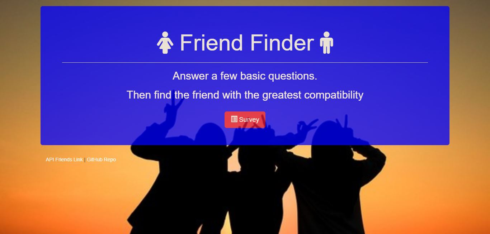
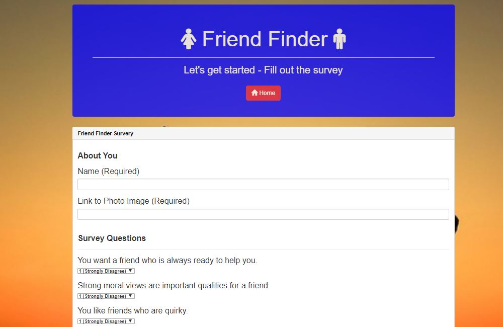

# Friend Finder
### Overview
Friend finder app is designed find a compatible friend based preset questions with scores based on the scores it matches them with similar tastes/views from the list.
This app is built on Node.js using Express and with Jquery and AJAX.

### This App is built With following npm Installations  and Programming languages

* [Node.js] (https://nodejs.org/en/)

* [JavaScript] (https://www.javascript.com/)

* [JQUERY]  (https://jquery.com/)

* [Node.js] (https://nodejs.org)

* [Express.js]	(https://expressjs.com/)

### Command to run the App

1. node server.js 

 * Running this application will first display Home page. 

2. Then user will click on the servey button which loads survey page.User need to enter his name and link to him pic/image and answer questions.
   based on the user answers the map will match the user with most compatible freind and displays his/her name with a picture.	

